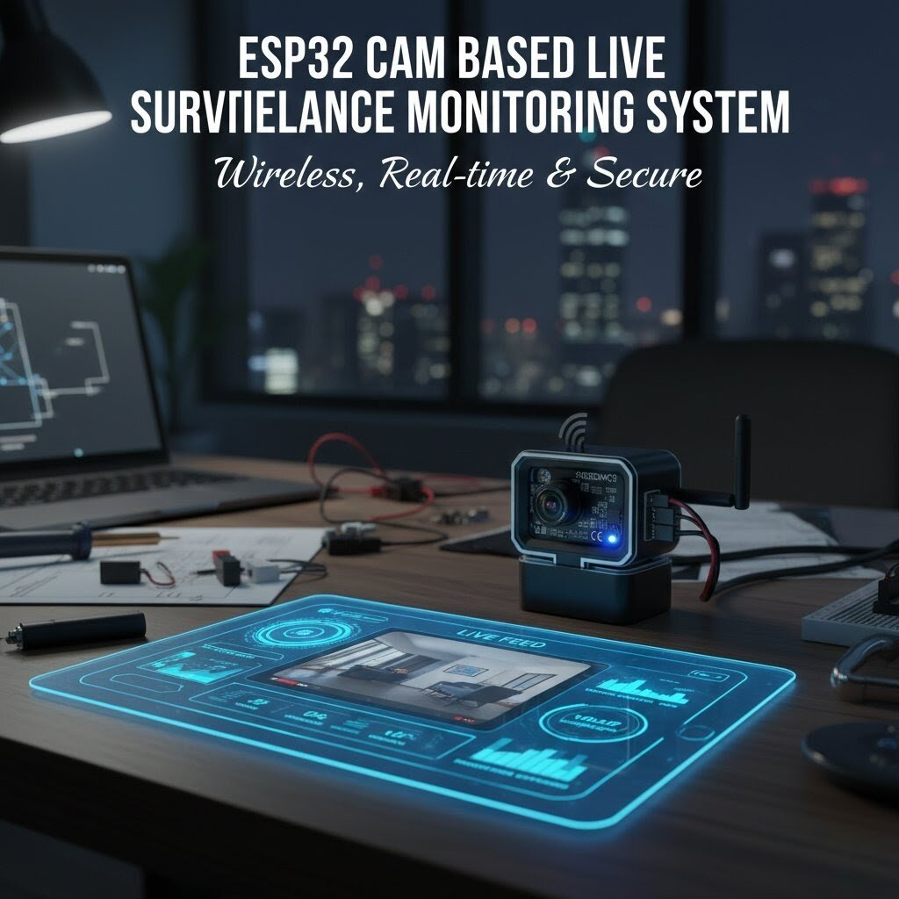

# ESP32-CAM Smart Security Camera

A WiFi-enabled smart security camera built using the ESP32-CAM module that provides live video streaming through a browser IP portal and sends motion alerts directly to Telegram using a bot API.

# Overview

The ESP32-CAM Smart Security Camera is a compact IoT surveillance system designed for homes, classrooms, offices, and laboratories. The system hosts a live video stream that can be accessed through the ESP32-CAM's IP address in a web browser.

The camera continuously monitors the environment for motion. When movement is detected, the system automatically sends an alert message through Telegram using a Bot API, allowing the user to receive instant notifications on their mobile device.

# Features

- Live video streaming through browser IP portal
- WiFi based remote access
- Motion detection alert system
- Telegram notification using Bot API
- Low-cost IoT surveillance solution
- Compact embedded system using ESP32-CAM

# Hardware Components

- ESP32-CAM Module
- FTDI Programmer (for uploading code)
- PIR Motion Sensor
- 5V Power Supply
- Jumper Wires
- Optional MicroSD Card

  

  

# Software and Technologies

- Arduino IDE
- ESP32 Board Package
- Telegram Bot API
- WiFi Communication
- Embedded C++

# Working Principle

1. The ESP32-CAM connects to the local WiFi network.
2. After connecting, the device hosts a web server that provides live video streaming.
3. The user opens the ESP32-CAM IP address in a browser to view the live feed.
4. A PIR motion sensor continuously monitors movement.
5. When motion is detected, the ESP32-CAM triggers a Telegram message using the Bot API.
6. The user receives the alert instantly on their Telegram account.

# Telegram Alert System

The system integrates with Telegram using a bot created through BotFather. When motion is detected, the ESP32-CAM sends an HTTP request to the Telegram Bot API which delivers an alert message directly to the user.

Example alert message:

Motion Detected by ESP32-CAM Security Camera.

# Applications

- Home security monitoring
- Classroom surveillance
- Laboratory monitoring
- Smart IoT security systems
- Remote area monitoring

# Future Improvements

- Image capture when motion is detected
- Video recording to SD card
- Night vision support using IR LEDs
- Cloud storage integration
- Face detection or recognition

## Project Difficulty: Intermediate Embedded System

## Development Time: Less than a Week! [ Trust Me! :) ]

# Author

Embedded Systems Project by Jash. 
